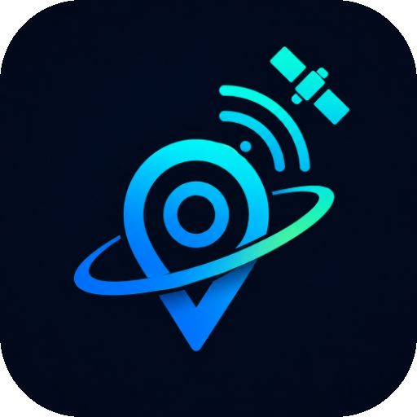

<div align="center">

  

  # SkySense

  An educational, AI-powered GNSS visualizer built for Android. It turns your device into an advanced satellite tracker, helping you understand how GPS, Galileo, GLONASS, and other constellations work together to pinpoint your location on Earth.

  
  
  

</div>

## 🌟 Features

*   **Live Sky Map:** Watch satellites orbit overhead in real-time on a beautifully animated, compass-reactive sky plot.
*   **Deep Satellite Analytics:** Track detailed telemetry including Elevation, Azimuth, Signal-to-Noise Ratio (C/N₀), and dual-band frequencies (L1/L5). 
*   **Multi-Constellation Support:** Supports and maps signals from GPS (USA), GLONASS (Russia), Galileo (EU), BeiDou (China), QZSS (Japan), and IRNSS/NavIC (India).
*   **Live Dashboard:** Instantly view real-time accuracy estimations and Dilution of Precision (PDOP/HDOP/VDOP) with easy-to-understand explanations driven by a local interpretation engine.
*   **Ask AI Integration:** Powered by Google Gemini, ask context-aware questions about your live GNSS data ("Why is my accuracy poor right now?", "What's the difference between L1 and L5?").
*   **Constellation Explorer:** Learn the history, purpose, and fun facts about the global navigation systems orbiting above us.
*   **Session History & Analytics:** View graphs and trends of your satellite connections and accuracy over time.

## 🚀 Installation

You can install SkySense directly on your Android device:

1.  Download the latest `app-release.apk` from the **[Releases](https://github.com/midhun956/SkySense/releases/)** section of this repository.
2.  Open the downloaded APK on your Android device.
3.  If prompted, allow your browser or file manager to "Install unknown apps".
4.  Once installed, open SkySense and grant the required Location permissions to start receiving satellite data.
5.  *(Optional)* To unlock the **Ask AI** feature, you need a free Google Gemini API Key:
    * Go to [Google AI Studio](https://aistudio.google.com/api-keys/).
    * Sign in with your Google Account and click **Create API Key**.
    * Copy the key, open the **Settings** tab in SkySense, and paste it under the AI configuration section.

> **Note:** Android Emulators do not have physical GNSS receivers. To experience the app's full capabilities, it must be installed on a physical Android device outside with a clear view of the sky.

## 🏗️ Project Architecture

```text
com.skysense.app/
├── data/
│   ├── db/             # Room database, DAOs, entities
│   ├── model/          # Domain models (SatelliteInfo, GnssSnapshot, etc.)
│   ├── repository/     # GnssRepository, HistoryRepository
│   └── remote/         # GeminiApiClient (OkHttp)
├── service/
│   └── GnssService     # LocationManager + GnssStatus + GnssMeasurements
├── ui/
│   ├── theme/          # Color, Type, Theme (Space dark M3)
│   ├── navigation/     # NavHost, Destinations
│   ├── dashboard/      # DashboardScreen + ViewModel
│   ├── skymap/         # SkyMapScreen + Canvas sky plot + ViewModel
│   ├── satellite/      # SatelliteDetailScreen
│   ├── constellation/  # ConstellationExplorerScreen
│   └── learn/          # Learn GNSS glossary screen
└── domain/             # LocalInterpretationEngine (Pure Kotlin)
```

## 🔒 Privacy & Permissions

SkySense requires `ACCESS_FINE_LOCATION` to access the raw GNSS measurements from the Android OS. 
All interpretation and data plotting is done entirely **offline on your device**. Location data is never sent to any external server, except when explicitly using the "Ask AI" feature, which sends a snapshot of your current satellite metrics (not your coordinates) to the Gemini API.

## 🛠️ Built With

*   **Kotlin** & **Jetpack Compose**
*   **Google Gemini API** (Generative AI integration)
*   **Jetpack DataStore & Google Tink** (Encrypted preferences)
*   **Room Database** (Local persistence)
*   **Coroutines & Flows** (Asynchronous programming)

## 📝 License

This project is licensed under the MIT License - see the LICENSE file for details.
